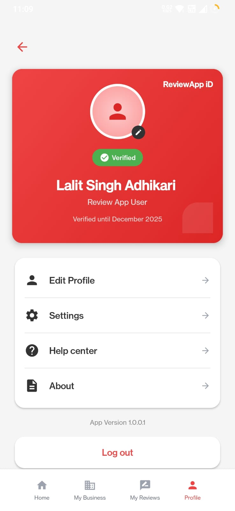
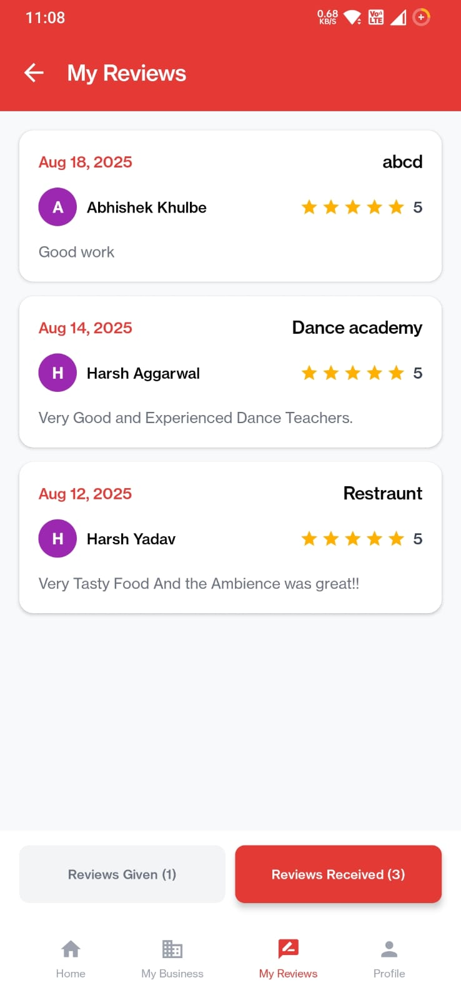
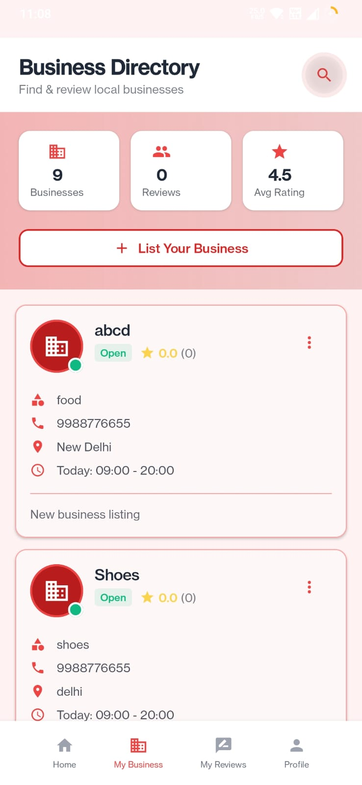
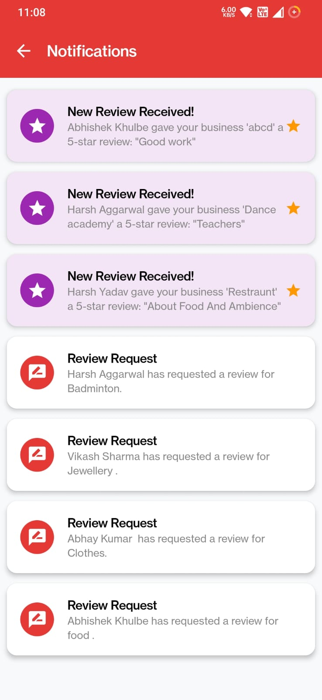

# 📱 Review App


> A modern Android application built with *Kotlin, **Jetpack Compose, and **Firebase* that lets users *list businesses, send review requests, and give/receive reviews* in real time.  

---

## 📖 Table of Contents
1. [Overview](#-overview)
2. [Features](#-features)
3. [Screenshots](#-screenshots)
4. [Architecture](#-architecture)
5. [Tech Stack](#-tech-stack)
6. [Build & Dependencies](#-build--dependencies)
7. [Firebase Setup](#-firebase-setup)
8. [Project Structure](#-project-structure)
9. [UI Flow](#-ui-flow)
10. [Setup & Installation](#-setup--installation)
11. [Testing](#-testing)
12. [Contributing](#-contributing)

---

## 📖 Overview
*Review App* is a platform for businesses and customers to interact through reviews.  
It allows *business owners* to showcase their services and *users* to send, receive, and give reviews seamlessly.  

- *Target Users*: Small businesses, startups, and customers looking for transparent feedback.  
- *Goal*: Build trust between businesses and users through verified review exchanges.  

---

## ✨ Features

- 🔐 *User Authentication* (Sign up, login, password reset – Firebase Auth)  
- 🏢 *Business Management* (list, edit, display businesses)  
- 📬 *Review Requests* (ask other users for reviews via notifications)  
- ⭐ *Give Reviews* (title, description, rating, photo/video uploads)  
- 🔔 *Notifications* (review requests & navigation to screens)  
- 👤 *User Profiles* (edit profile details + profile picture)  
- 📰 *Featured Businesses* (highlighted on the home feed)  
- ⚡ *Real-time Updates* with Firestore  

---

## 📸 Screenshots

| Login Screen | Profile Screen | AskForReview Screen | MyBusiness Screen | Notification Screen |
|--------------|-------------|----------------|----------------|----------------|
|  |  |  |  | 

---

## 🏗 Architecture

The app follows *MVVM (Model-View-ViewModel)*:

- *UI Layer* → Jetpack Compose screens  
- *ViewModels* → Manage state with LiveData / State  
- *Repository Layer* → Handles Firebase operations  
- *Models* → Data classes for User, Business, Review, Notification  

---

## ⚙ Tech Stack

- *Language*: Kotlin  
- *UI*: Jetpack Compose + Material 3  
- *Architecture*: MVVM  
- *Backend*: Firebase (Auth, Firestore, Storage, Messaging)  
- *Image Loading*: Coil  
- *Navigation*: Jetpack Navigation Compose  
- *Testing*: JUnit, Espresso, Compose UI Testing  

---

## 📲 Build & Dependencies

### Android Configuration
kotlin
android {
    namespace = "com.example.reviewapp"
    compileSdk = 35

    defaultConfig {
        applicationId = "com.example.reviewapp"
        minSdk = 28
        targetSdk = 35
        versionCode = 1
        versionName = "1.0"
    }

    compileOptions {
        sourceCompatibility = JavaVersion.VERSION_11
        targetCompatibility = JavaVersion.VERSION_11
    }

    kotlinOptions {
        jvmTarget = "11"
    }

    buildFeatures {
        compose = true
    }
}
 

### Dependencies
```
 // Firebase
implementation("com.google.firebase:firebase-auth-ktx:22.3.1")
implementation("com.google.firebase:firebase-firestore-ktx:25.1.0")
implementation("com.google.firebase:firebase-storage-ktx:21.0.2")

 // Jetpack Compose
implementation(platform(libs.androidx.compose.bom))
implementation(libs.androidx.ui)
implementation(libs.androidx.material3)
implementation("androidx.navigation:navigation-compose:2.9.2")
implementation("androidx.compose.runtime:runtime-livedata:1.8.3")

 // Image Loading
implementation("io.coil-kt:coil-compose:2.4.0")
```
## 🔑 Firebase Setup

1. Go to Firebase Console
.

2. Create a project and add an Android app with your package name.

3. Enable:

    -> Authentication → Email/Password

    -> Firestore Database

    -> Firebase Storage

   -> Cloud Messaging

4. Download google-services.json and place it inside /app.

5. Sync project with Gradle files.

## 📂 Project Structure
```
app/
 └── src/
     └── main/
         ├── java/
         │   └── com/example/reviewapp/
         │       ├── ui/theme/
         │       │   ├── Color.kt
         │       │   ├── Theme.kt
         │       │   └── Type.kt
         │       ├── Screens/
         │       │   ├── AboutScreen.kt
         │       │   ├── AskForReviewScreen.kt
         │       │   ├── EditProfileScreen.kt
         │       │   ├── ForgotPasswordScreen.kt
         │       │   ├── GiveReview.kt
         │       │   ├── HelpCenterScreen.kt
         │       │   ├── HomeScreen.kt
         │       │   ├── Login.kt
         │       │   ├── MyBusinessScreen.kt
         │       │   ├── MyReviewsScreen.kt
         │       │   ├── NotificationScreen.kt
         │       │   ├── OnboardingScreen.kt
         │       │   ├── ProfileScreen.kt
         │       │   ├── QueryScreen.kt
         │       │   ├── RegisterScreen.kt
         │       │   ├── SettingsScreen.kt
         │       │   └── VerifyPasswordScreen.kt
         │       ├── AuthViewModel.kt
         │       ├── MainActivity.kt
         │       └── MyAppNavigation.kt
         └── res/
```
## 🎨 UI Flow
1. Authentication → Login/Signup

2. Home Screen → Featured Businesses

3. Business Flow → Add / View / Edit Businesses

4. Review Flow →

    -> Ask for Review (search users + select business)

    -> Give Review (rating, text, media)

    -> My Reviews (given & received)

5. Notifications → Tap to navigate directly to review detail and will show the reviews recieved and reviews requested notifications.
## 🛠 Setup & Installation
1. Clone this repository:

git clone https://github.com/Lalitadhikari30/ReviewApp.git


2. Open in Android Studio (Narwhal or newer).

3. Add google-services.json in /app/.

4. Sync Gradle.

5. Run on an emulator or physical device.
## 🧪 Testing
1. ✅ Authentication Flow

2. ✅ Business Listing & Management

3. ✅ Review Request / Submission

4. ✅ Notifications Navigation

5. ✅ Firestore Sync across devices
## 🤝 Contributing
Contributions are welcome!

1. Fork the repository

2. Create a new branch (feature/my-feature)

3. Commit changes with clear messages

4. Push and create a Pull Request


---
